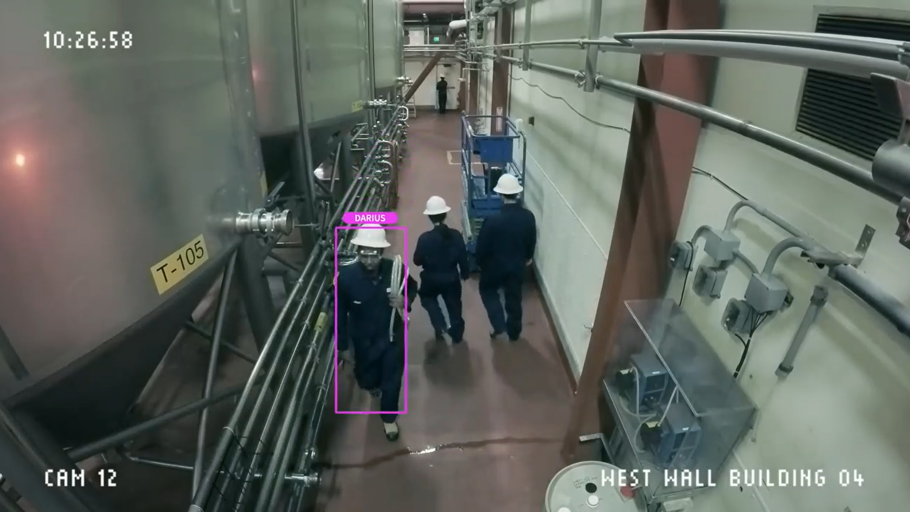
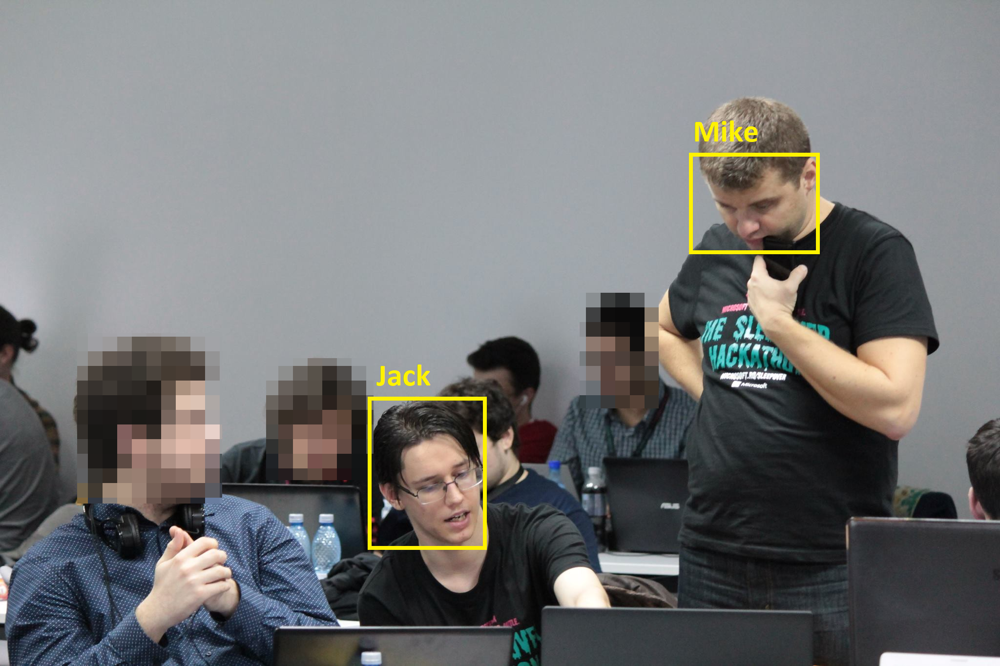

# Challenge #1. Recognize faces in images while protecting people's privacy

## Introduction

*(adapted from [whatis.com](https://whatis.techtarget.com/definition/closed-circuit-television-CCTV))*

[CCTV](https://en.wikipedia.org/wiki/Closed-circuit_television) (closed-circuit television) is a TV system in which signals are not publicly distributed but are monitored, primarily for surveillance and security purposes.

CCTV relies on strategic placement of cameras, and observation of the camera's input on monitors somewhere. Because the cameras communicate with monitors and/or video recorders across private coaxial cable runs or wireless communication links, they gain the designation "closed-circuit" to indicate that access to their content is limited by design only to those able to see it.

CCTV is commonly used for a variety of purposes, including:

* Maintaining perimeter security in medium- to high-secure areas and installations.
* Observing behavior of incarcerated inmates and potentially dangerous patients in medical facilities.
* Traffic monitoring.
* Overseeing locations that would be hazardous to a human, for example, highly radioactive or toxic industrial environments.
* Building and grounds security.
* Obtaining a visual record of activities in situations where it is necessary to maintain proper security or access controls (for example, in a diamond cutting or sorting operation; in banks, casinos, or airports).

However, CCTV can run afoul of privacy laws - most notably, the [General Data Protection Regulation (GDPR)](https://eugdpr.org/) law already in effect in the EU.

Much of the focus of the discussion around GDPR has been on text-based personal data; for instance, name, email and physical address details, date of birth, financial information etc. What has received less attention, however, is the equal importance of visual data, such as images and video. But in instances where organizations are involved in capturing or processing visual data in which an individual could be identified either directly or indirectly, GDPR still applies.

## The Challenge

Your challenge is to enhance an existing CCTV system with the capability to:

* receive training to recognize specific people (employees) and distinguish them from other people (visitors) inside a facility
* recognize faces in the footage it captures
* visually mark the faces of people it has successfully recognized (employees)
* blur (or otherwise obscure) the faces of the people it **doesn't** recognize. 

To keep things simple, **you will be working with still images rather than video**.

Your application should allow the user to upload an image, then present back to them a modified version of this image with the recognized faces highlighted, and the unrecognized faces obscured, like in the example below:

|  | 
|:---:|:---:|
| original image | processed image |

> NOTE: You are required to create *at least one* recognizable Person (employee).

> NOTE: There is no image dataset for this challenge. You could either take pictures of yourself and your team members to use on the Face API, or search online for publicly available images.

## Hints

1. The [Face API](https://azure.microsoft.com/en-us/services/cognitive-services/face/) should be useful for this challenge.
2. You can [create a PersonGroup](https://westus.dev.cognitive.microsoft.com/docs/services/563879b61984550e40cbbe8d/operations/563879b61984550f30395244) and then [create Persons](https://westus.dev.cognitive.microsoft.com/docs/services/563879b61984550e40cbbe8d/operations/563879b61984550f3039523c) to define the list of recognizable people (employees). You will need to provide at least 2-4 photos for each person in order for them to be correctly recognized.
3. If you've got a Windows 10 machine, you can use the **Intelligent Kiosk** app - either [the store version](https://www.microsoft.com/en-us/p/intelligent-kiosk/9nblggh5qd84?activetab=pivot%3aoverviewtab) or by [building it from source](https://github.com/Microsoft/Cognitive-Samples-IntelligentKiosk) - to quickly configure your Person Group and upload training images.

## Useful Links

1. [Face Service Documentation](https://docs.microsoft.com/en-us/azure/cognitive-services/face/)
2. [Face API Reference and Testing Console](https://westus.dev.cognitive.microsoft.com/docs/services/563879b61984550e40cbbe8d/operations/563879b61984550f30395236)
3. [Example: How to identify faces in images](https://docs.microsoft.com/en-us/azure/cognitive-services/face/face-api-how-to-topics/howtoidentifyfacesinimage)
4. [Example: How to Analyze Videos in Real-time](https://docs.microsoft.com/en-us/azure/cognitive-services/face/face-api-how-to-topics/howtoanalyzevideo_face)
