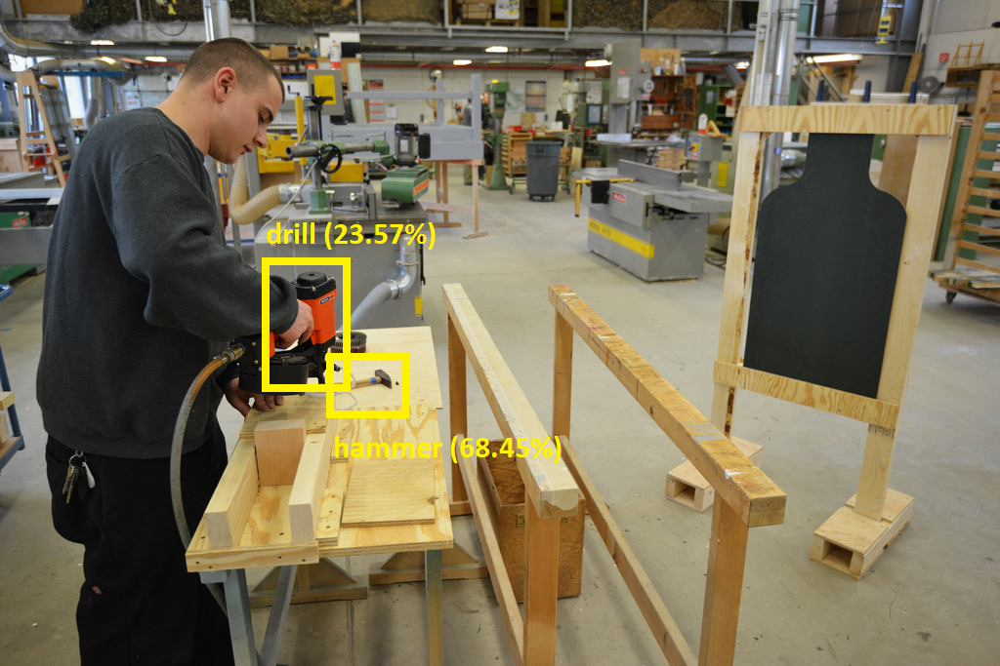

# Challenge #3. Automatically detect tools and help workers become more  efficient

## Introduction

*(adapted from [hackernoon.com](https://hackernoon.com/how-visual-object-detection-can-transform-manufacturing-industries-8b6698cc0a47))*

**Computer Vision** is the field that deals with empowering computers the ability to ‘see’ things like humans. **Object Detection** is a basic visual perception task and one of the key areas of applications of Computer Vision. It essentially deals with finding and locating specific objects within an image.


For detecting generic objects (like *car*, *person*, *table*, *tree*) there are open-source and pre-trained models available. However, if you want an algorithm to detect very specific objects (like a *small raw tomato* or a *large ripe tomato*), you will need to train an object detection algorithm of your own.

### Object detection in Manufacturing

Finding a specific object through visual inspection is a basic task that is involved in multiple industrial processes like sorting, inventory management, machining, quality management, packaging etc. 

#### Quality Management

Till date, the quality control part of the manufacturing cycle continues to be a difficult task due to its reliance on human-level visual understanding and adaptation to constantly changing conditions and products. 

With AI, most of these complications can be handled. AI can automatically distinguish good parts from faulty parts on an assembly line with incredible speed allowing you enough time to take corrective action. This is a very useful solution for dynamic environments where product environments are constantly changing, and time is valuable to the business.

#### Inventory Management

Inventory management can be very tricky as items are hard to track in real time, something is always added, removed and moved every day. 

Poor Inventory management can hurt the company both in terms of capital and time. AI system can perform automatic object counting and localization that will allow you to improve inventory accuracy. 

AI automation removes human error from the equation by accurately counting your holding and outgoing inventory. When automated, businesses will order the right quantity of products at the best possible price, ensuring that no money is wasted on inaccurate or extraneous orders.

#### Sorting

Manual sorting involves high cost of labor and accompanying human errors. Even with robots, the process is not accurate enough and is still prone to a discrepancy. With AI-powered Object Tracking the objects are classified as per the parameter selected by the manufacturer and statistics of the number of objects is displayed. It significantly reduces the abnormalities in categorization and makes the assembly line more flexible. 

For example, in Agriculture industries Sorting plays a critical role in the assembly line. It is imperative for the company to identify and discard damaged fruits/vegetables which can affect the finished product. 

AI-powered Object Detection can help transform this tedious and manual process into an efficient and automated process while maintaining the same if not better level of accuracy.

#### Assembly Line

Today we have fully automated assembly lines even for complex products like cars. However, each movement of robotic arms and raw materials/components are defined and played as per a script.

To give the modern automatic assembly line more flexibility, it is important to teach machines to locate and move different products/components accurately. AI-powered object detection opens the doors towards this possibility.

## The Challenge

You are tasked with adding object detection capabilities to existing surveillance cameras. You need to make it possible to detect several commonly-used tools like 
* hammers
* ratchets
* drills
* screwdrivers
* chainsaws
* wrenches.

You have a dataset of images available, which you can use for training the model. 

**[CLICK HERE to download the image archive for this challenge](https://sorinpecognitive.blob.core.windows.net/cognitivechallenge/cognitivechallenge3.zip)**. 

 > NOTE: The image dataset is based on the [Open Images Dataset V4](https://storage.googleapis.com/openimages/web/index.html) dataset published by Google. Only a subset of data is used for this challenge.

The image archive contains three folders:

 * **train** - images which you have available during the project implementation, and can be used for training a Computer Vision model 
 * **test** - images which you have available during the project implementation, and can be used for testing the performance of the model. This data is NOT used during training.
 * **validation** - images from the production phase, which the system should be able to correctly classify despite never seeing them before during training.

Each folder also contains text labels inside a **Label** folder. These text files describe the rectangle bounding boxes for each object, in pixels.

```txt
Chainsaw 327.575552 360.854994 782.249984 529.166559
```

Your job is to build an object recognition model and a small application which will allow the user to upload a photo containing one or more tools. The application should highlight the tools it recognized in the image, with a confidence level for each tool, like in the example below.

|   |  
|:---:|:---:|
| original image | processed image |

> NOTE: In order to make sure that your Computer Vision model can respond to unseen images, when testing ALWAYS use images from the **test** and **validation** folders inside the dataset. Images from the **test** and **validation** folders should NOT be used for training.

## Hints

1. The [Custom Vision Service](https://www.customvision.ai/) should come in handy for this challenge.
2. You will need to create an Object Detection project in the Custom Vision service.
3. There are many images available inside the **training** folder, but you might not need to use all of them for training. Indeed, it may prove counterproductive to use some of the images!
4. The minimum number of labeled examples for each tag (for example, *Chainsaw*) in Object Detection is **15**. However, the more examples you can provide, the better the model will generally perform. We recommend to provide about **50** labeled examples for each tag.


## Useful Links

1. [What is the Custom Vision Service?](https://docs.microsoft.com/en-us/azure/cognitive-services/custom-vision-service/home)
2. [Tutorial: Build an object detection project with C#](https://docs.microsoft.com/en-us/azure/cognitive-services/custom-vision-service/csharp-tutorial-od)
3. [Tutorial: Build an object detection project with Python](https://docs.microsoft.com/en-us/azure/cognitive-services/custom-vision-service/python-tutorial-od)
4. [Tutorial: Build an object detection project with Java](https://docs.microsoft.com/en-us/azure/cognitive-services/custom-vision-service/java-tutorial-od)
5. [Use the prediction API](https://docs.microsoft.com/en-us/azure/cognitive-services/custom-vision-service/use-prediction-api)
6. [Custom Vision Prediction API reference](https://southcentralus.dev.cognitive.microsoft.com/docs/services/450e4ba4d72542e889d93fd7b8e960de/operations/5a6264bc40d86a0ef8b2c290)