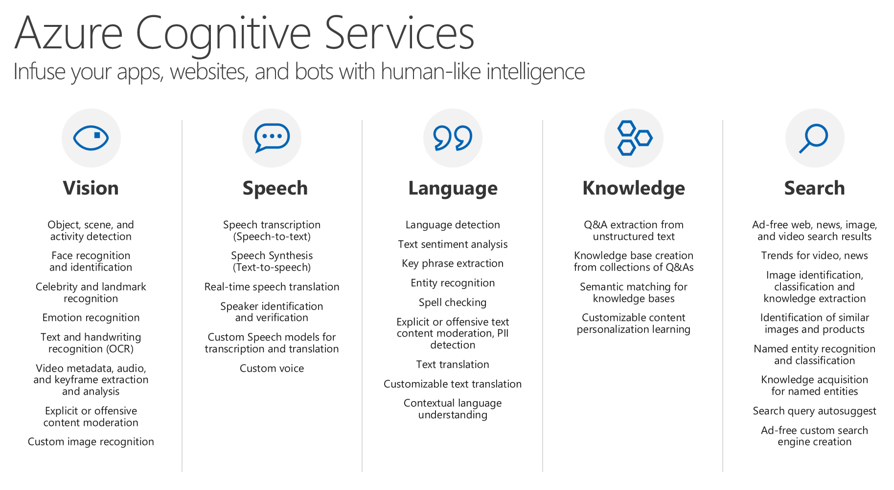
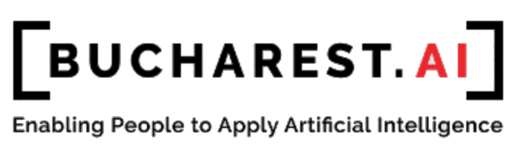

# Bucharest.AI + Microsoft Cognitive Challenge

This repository supports the BucharestAI + Microsoft Cognitive Services Challenge

## What are Azure Cognitive Services?

[Azure Cognitive Services](https://azure.microsoft.com/en-us/services/cognitive-services/) are APIs, SDKs, and services available to help developers build intelligent applications without having direct AI or data science skills or knowledge.

Azure Cognitive Services expand on Microsoft’s evolving portfolio of machine learning APIs and enable developers to easily add cognitive features – such as emotion and video detection; facial, speech, and vision recognition; and speech and language understanding – into their applications.

The goal of Azure Cognitive Services is to help developers create **applications that can see, hear, speak, understand**, and even begin to **reason**. 

The catalog of services within Azure Cognitive Services can be categorized into five main pillars:

* **[Vision](https://azure.microsoft.com/en-us/services/cognitive-services/directory/vision/)** - Image-processing algorithms to smartly identify, caption and moderate your pictures.
* **[Speech](https://azure.microsoft.com/en-us/services/cognitive-services/directory/speech/)** - Convert spoken audio into text, use voice for verification, or add speaker recognition to your app.
* **[Language](https://azure.microsoft.com/en-us/services/cognitive-services/directory/lang/)** - Allow your apps to process natural language with pre-built scripts, evaluate sentiment and learn how to recognize what users want.
* **[Search](https://azure.microsoft.com/en-us/services/cognitive-services/directory/search/)** - Add Bing Search APIs to your apps and harness the ability to comb billions of webpages, images, videos, and news with a single API call.
* **[Knowledge](https://azure.microsoft.com/en-us/services/cognitive-services/directory/know/)** - Map complex information and data in order to solve tasks such as intelligent recommendations and semantic search.

## Prerequisites

In order to complete all the challenges, you will need:

1. A free Microsoft account. [Click here](https://account.microsoft.com/account) to create one.
2. A Microsoft Azure subscription. You can [get a free trial here](https://azure.microsoft.com/en-us/free/), or your instructor may have an Azure subscription ready for you. Many Cognitive Services APIs have [free tiers for you to use](https://azure.microsoft.com/en-us/try/cognitive-services/).
3. The programming language and development tools of your choice. You can complete this challenge by using plain HTML and Javascript, Node.js, .NET, C, C++, Java, Python, Go, Rust, Ruby... basically, any development framework which allows you to make [REST](https://www.restapitutorial.com/) calls to existing services is good to go.

## The Challenges!

You can find the requirements for each challenge below:

* **Challenge #1**: [Recognize faces in images and protect people's privacy](FaceDetection.md)
* **Challenge #2**: [Automatically inspect components on a factory production line](VisualInspection.md)
* **Challenge #3**: Improve workplace safety by detecting left-behind equipment (TODO)

## Powered By

  
  

