# Challenge #2. Automatically inspect components on a factory production line

# Introduction

*(adapted from [deepsense.ai](https://deepsense.ai/spot-the-flaw-visual-quality-control-in-manufacturing/))*

Quality assurance in manufacturing is demanding and expensive, but also absolutely crucial. After all, selling flawed goods results in returns and disappointed customers. Harnessing the power of image recognition and deep learning may significantly reduce the cost of visual quality control while also boosting overall process efficiency.

Image credit: [Banner engineering](https://www.bannerengineering.com/sg/en/solutions/part-quality-inspection.img.png)

According to Forbes, automating quality testing with machine learning can [increase defect detection rates by up to 90%](https://www.forbes.com/sites/louiscolumbus/2018/03/11/10-ways-machine-learning-is-revolutionizing-manufacturing-in-2018/#3787fd723ac1). Machines never tire, nor lose focus or need a break. And every product on a production line is inspected with the same focus and meticulousness.

Yield losses, the products that need to be reworked due to defects, may be one of the biggest cost-drivers in the production process. In semiconductor production, testing cost and yield losses can constitute up to 30% of total production costs.

Traditional quality control is time-consuming. It is manually performed by specialists testing the products for flaws. Yet the process is crucial for business, as product quality is the pillar a brand will stand on. It is also expensive. Electronics industry giant Flex claims that for every 1 dollar it spends creating a product, it lays out 100 more on resolving quality issues.

Since the inception of image recognition software, manufacturers have been able to incorporate IP cameras into the quality control process. Most of the implementations are based on complex systems of triggers. But with the conditions predefined by programmers, the cameras were able to spot only a limited number of flaws. While the technology may not yet have been worthy of the title game changer, the image recognition revolution was one step further.

Artificial intelligence may enhance the company’s ability to spot flawed products. Instead of embedding complex and lengthy lists of possible flaws into an algorithm, the algorithm **learns the product’s features**. With the vision of the perfect product, the software can easily spot imperfect ones.

## The Challenge

You are working inside a factory producing components which happen to have the shape of LEGO bricks. There are various shapes and sizes of components, for multiple purposes. The components are travelling individually on the assembly line; however, not all of them are positioned correctly for the next step in the assembly process. 

All components should be positioned **face up**, with the bindings facing the camera or at the very least clearly visible by the camera. Components which are facing **down** or **sideways** should be flagged by the visual inspection system so that they are correctly repositioned by a robotic or human operator.

Below are some examples of **correctly placed components**:

    <table>
	    <tr>
    	    <td style="padding:5px">
        	    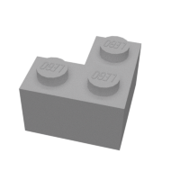
      	    </td>
    	    <td style="padding:5px">
        	    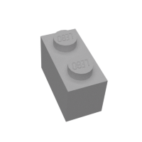
      	    </td>
    	    <td style="padding:5px">
        	    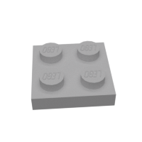
      	    </td>
    	    <td style="padding:5px">
        	    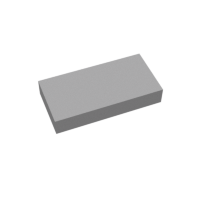
      	    </td>
    	    <td style="padding:5px">
        	    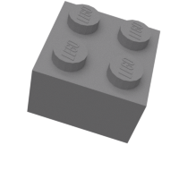
      	    </td>
    	    <td style="padding:5px">
        	    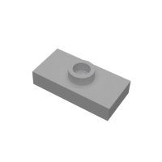
      	    </td>
        </tr>
    </table>

And here are some examples of **incorrectly placed components**:

    <table>
	    <tr>
    	    <td style="padding:5px">
        	    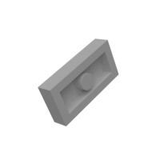
      	    </td>
    	    <td style="padding:5px">
        	    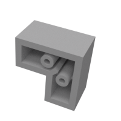
      	    </td>
    	    <td style="padding:5px">
        	    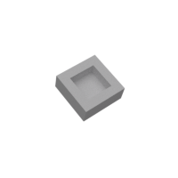
      	    </td>
    	    <td style="padding:5px">
        	    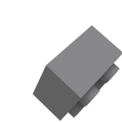
      	    </td>
    	    <td style="padding:5px">
        	    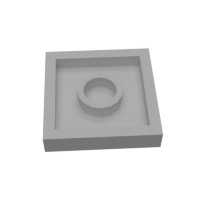
      	    </td>
    	    <td style="padding:5px">
        	    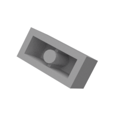
      	    </td>
        </tr>
    </table>

We have prepared a set of images to assist you in the training and validation process.

**[CLICK HERE to download the image archive](input/cognitivechallenge2.zip)**. 

 > NOTE: The image dataset is based on the openly available [Images of LEGO Bricks](https://www.kaggle.com/joosthazelzet/lego-brick-images) dataset published on Kaggle.com.

 The image archive contains two folders:

 * **training** - images which you have available during the project implementation, and can be used for training a Computer Vision model 
 * **validation** - images from the production phase, which the system should be able to correctly classify despite never seeing them before during training.

Your application should allow the user to upload one or more test images of components, then display next to each image whether that component is correctly or incorrectly placed. Below is an example of a possible user interface you could create.

    <table>
	    <tr>
    	    <td style="padding:5px">
        	    
      	    </td>
    	    <td style="padding:5px">
        	    Correct
      	    </td>
        </tr>
	    <tr>
    	    <td style="padding:5px">
        	    
      	    </td>
    	    <td style="padding:5px">
        	    Incorrect
      	    </td>
        </tr>
	    <tr>
    	    <td style="padding:5px">
        	    
      	    </td>
    	    <td style="padding:5px">
        	    Correct
      	    </td>
        </tr>
	    <tr>
    	    <td style="padding:5px">
        	    
      	    </td>
    	    <td style="padding:5px">
        	    Correct
      	    </td>
        </tr>
	    <tr>
    	    <td style="padding:5px">
        	    
      	    </td>
    	    <td style="padding:5px">
        	    Incorrect
      	    </td>
        </tr>
    </table>

> NOTE: In order to make sure that your AI model can respond to unseen images, when testing ALWAYS use images from the **validation** folder inside the dataset. Images from the **validation** folder should NOT be used for training.

## Hints

1. The [Custom Vision Service](https://www.customvision.ai/) should come in handy for this challenge.
2. Since this is a [classification](https://en.wikipedia.org/wiki/Statistical_classification) problem, you will need to create a classification project in the Custom Vision service.
3. There are many images available inside the **training** folder, but you might not need to use all of them for training. Indeed, it may prove counterproductive to do so!
4. Although you could opt to create just two tags (for example *Correct* and *Incorrect*), the model may perform better if you create more than two, in order to capture more possible component positions.

## Useful Links

1. [What is the Custom Vision Service?](https://docs.microsoft.com/en-us/azure/cognitive-services/custom-vision-service/home)
2. [How to build a classifier with Custom Vision](https://docs.microsoft.com/en-us/azure/cognitive-services/custom-vision-service/getting-started-build-a-classifier)
3. [Test and retrain a model with Custom Vision Service](https://docs.microsoft.com/en-us/azure/cognitive-services/custom-vision-service/test-your-model)
4. [Use the prediction API](https://docs.microsoft.com/en-us/azure/cognitive-services/custom-vision-service/use-prediction-api)
5. [Custom Vision Prediction API reference](https://southcentralus.dev.cognitive.microsoft.com/docs/services/450e4ba4d72542e889d93fd7b8e960de/operations/5a6264bc40d86a0ef8b2c290)